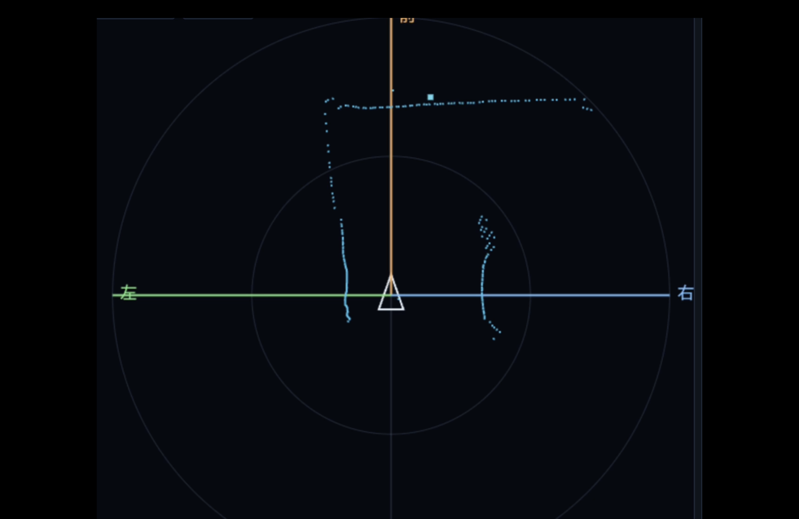
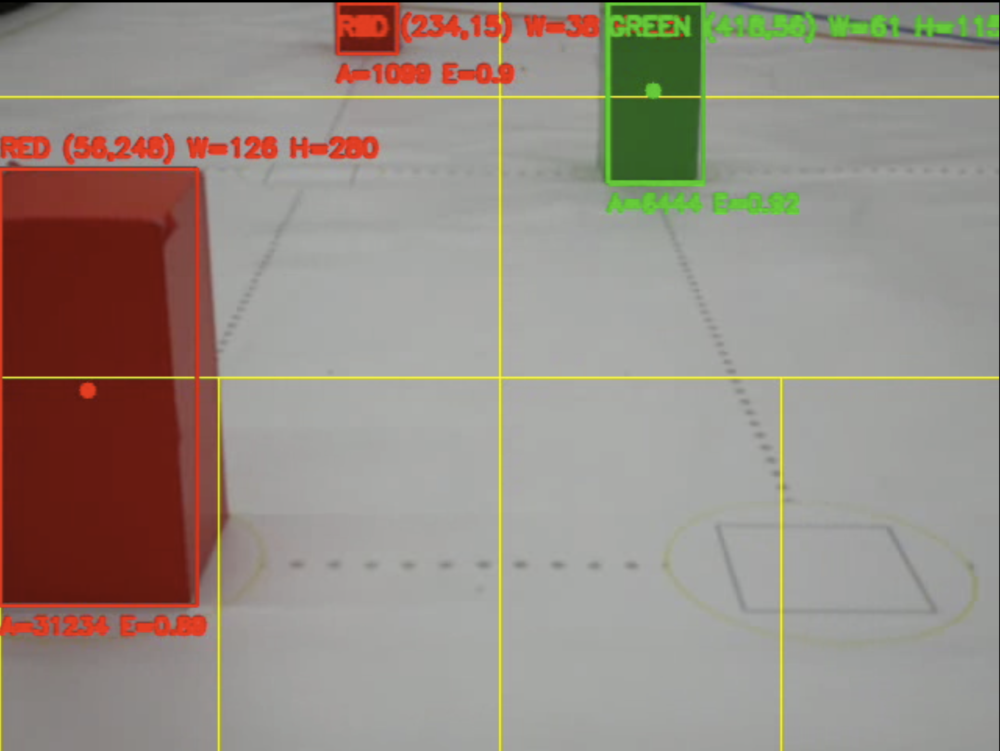

# Robot

## 1. Robot Introduction

### Microcontroller

Our robot uses a **Raspberry Pi 5** as its main controller.

Accurate object recognition requires camera-based image processing, and multiple sensors such as a LiDAR and a gyroscope must operate simultaneously. For this reason, we selected the Raspberry Pi because of its high processing performance and excellent expandability.

At the beginning of development, we used a Raspberry Pi 4. However, image processing required more computational power than expected, making real-time control difficult in some situations. After upgrading to the Raspberry Pi 5, image processing became significantly faster, resulting in more stable driving performance.

### LiDAR

Our robot uses a **LiDAR** to detect walls, measure distances, and perform wall following.

Although ultrasonic sensors were considered, they can only measure distance in a single direction. In contrast, a LiDAR provides **360-degree distance measurements** in a single scan. This allows the robot to detect obstacles in front while simultaneously measuring the distances to both side walls, enabling more accurate localization and navigation.

Optimizing both the algorithms and processing speed was one of the biggest challenges during development. Through repeated testing and refinement, we successfully developed the current system.

### Camera

At the beginning of development, we used a **HuskyLens**. However, we found limitations in both recognition accuracy and flexibility, so we developed our own image recognition system from scratch.

We chose the **Raspberry Pi Camera** because of its excellent compatibility with the Raspberry Pi and its ability to capture images at high speed.

The captured RGB image is converted into the **HSV color space**, where red and green objects are extracted using color masks and binary thresholding. The contours of the extracted objects are then detected, and the coordinates of their four corners are obtained. These coordinates are used to determine each object's position and color for navigation.

### 3D Printing

Most mechanical parts were designed and manufactured using a **3D printer**. We selected **PETG** because it offers an excellent balance between printability and strength.

We also designed a custom Raspberry Pi HAT board to simplify wiring and improve maintainability.

### Steering Mechanism

Initially, our robot used a conventional steering mechanism. To improve turning performance, we adopted an **Ackermann steering mechanism**, high-torque motors, and a **differential gear**.

### Power Supply

The drive motors are powered by three **18650 lithium-ion batteries** connected in series. The steering servo receives 5 V through a buck converter. The Raspberry Pi is powered by a **5,000 mAh USB PD power bank**.

Separating the motor power supply from the control power supply improves stability by reducing voltage drops and electrical noise.

# Software

## Open Challenge

The robot primarily relies on **LiDAR** for navigation. The distances to the side walls are used in a **PID controller** to keep the robot near the center of the course, while a gyroscope corrects its heading.

When the front wall is detected within a predefined distance, the robot performs a precise **90-degree turn** using gyroscope feedback.

The driving direction is determined by monitoring changes in the distances to the side walls. If one side suddenly becomes open, the robot turns in that direction.

## Obstacle Challenge

The robot primarily uses the **Raspberry Pi Camera** to detect obstacles.

Among all detected objects, the one appearing lowest in the image is regarded as the closest obstacle. If it is **red**, the robot passes on the left. If it is **green**, the robot passes on the right.

The steering angle is continuously adjusted so that the object's center moves toward a predefined target position in the camera image. After the obstacle has been cleared, the steering gradually returns to the neutral position and the robot moves back to the center of the course.

This process is repeated until all obstacles are avoided successfully.
