# Otemon PathFinder

  
  

- [Hardware](#hardware)

  - [Photos of Robots](#photos-of-robots)

  - [Videos](#videos)

  - [Main Components](#main-components)

  - [Controller](#controller)

  - [LiDAR](#lidar)

  - [Camera](#camera)

  - [Chassis](#chassis)

  - [Steering Mechanism](#steering-mechanism)

  - [Electrical System](#electrical-system)

- [Software](#software)

  - [Open Challenge](#open-challenge)

  - [Obstacle Challenge](#obstacle-challenge)

# Hardware

## Photos of Robots

  
  

  
  

  
  

  
  

  
  

## Videos
<table align="center">
  <tr>
    <td align="center" width="50%">
      <a href="https://youtu.be/6eP5m4vgBc8">
         
        <b>Open_ChallengeCounter-clockwise</b>
      </a>
    </td>
    <td align="center" width="50%">
      <a href="https://youtu.be/HAOU7pk2X0k">
         
        <b>Open_Challenge_clockwise</b>
      </a>
    </td>
  </tr>
  <tr>
    <td align="center" width="50%">
      <a href="https://youtu.be/kFfds26Y_WM">
         
        <b>Obstacle_ChallengeCounter-clockwise</b>
      </a>
    </td>
    <td align="center" width="50%">
      <a href="https://youtu.be/7NU6L5QEaes">
         
        <b>Obstacle_Challenge_clockwise</b>
      </a>
    </td>
  </tr>
</table>

## Main Components

| Category| Model | 
|---|---|
| Controller | Raspberry Pi 5 |
| Subcomputer| Seeed XIAO RP2040 |
| LiDAR | T-mini Plus 12 |
| Camera | Camera Module 3 Wide |
| Motor Driver | DRV8871 | 
| Servo Motor | SG90 |
| Connectors | PWR-USBDCDC5 |

## Controller

Our robot uses a **Raspberry Pi 5** as its main controller.

To accurately recognize objects, the robot must process camera images while simultaneously handling data from multiple sensors, including a LiDAR and a gyroscope. Therefore, we selected the Raspberry Pi because of its high computing performance and excellent expandability.

Unlike a conventional microcontroller, the Raspberry Pi is a compact computer that runs Linux. As a result, it is less suitable for applications requiring strict real-time control, such as motor control, and it also consumes more power. However, its powerful processing capability allows it to handle computationally intensive tasks, including image processing and LiDAR point cloud processing. Since these functions are essential for our robot, we concluded that the Raspberry Pi was the most suitable controller.

At the beginning of development, we used a **Raspberry Pi 4**. However, image processing required more computational power than expected, making real-time control difficult in some situations. After upgrading to the Raspberry Pi 5(Jun. 2026), image processing became significantly faster, resulting in much more stable driving performance.

We also adopted an **RP2040** as a sub-controller for motor control.

Because the Raspberry Pi 5 runs Linux, when we command it (for example, changing PWM values or reading encoders in Python), many processes such as LiDAR processing, camera processing, and communication are running simultaneously. As a result, **the processing timing can drift slightly**. Considering this and maintainability, we decided to offload motor control to the RP2040.

## LiDAR

Our robot uses a **LiDAR** for wall detection, distance measurement, and wall following.

We initially considered using ultrasonic sensors. However, ultrasonic sensors can only measure distance in a single direction, whereas the LiDAR can obtain distance information from almost the entire surrounding area, although part of its field of view is blocked by components such as the Raspberry Pi. This allows the robot to detect obstacles in front while simultaneously measuring the distances to both side walls, enabling more accurate self-localization.

One of the greatest challenges during development was designing an algorithm capable of accurately detecting walls using LiDAR point cloud data. In addition, because the robot must process a large amount of distance data in real time, optimizing the processing speed was also a major challenge. Through repeated testing and refinement, we continuously improved both the algorithm and the software until the current system was completed.

Currently, for each full rotation of LiDAR data (angle and distance), we remove points behind the robot and points with abnormal distances, and convert points within 3 m into planar coordinates. Then, using RANSAC, we search for line-shaped point sets: we randomly choose two points to form a line, collect points within 50 mm of that line, and repeat this 100 times, selecting the line that gathers the most points. We then refine the line using the gathered points, and treat a segment as a wall if it has at least 10 points and a length of at least 100 mm. Up to four walls are detected. If the gap between points exceeds 250 mm, we treat them as separate clusters.
Among the detected walls, we select up to the three walls with the highest number of points and classify them into right wall / front wall / left wall based on the direction of the perpendicular from the LiDAR to the wall. If three walls are available, we assign right–front–left in order of angle. If only one or two are available, we assign roles based on which reference direction they are closest to. However, to be used as a front wall, the wall must be at least 500 mm long. Distances to walls are computed using the perpendicular distance from the LiDAR to the wall line, and we follow whichever side wall is longer. This recognition is performed every rotation, and we do not build a map by accumulating past point clouds.

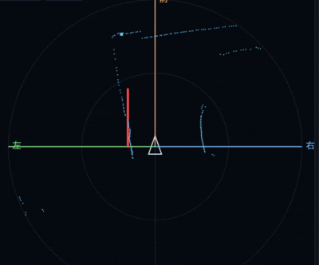

## Camera

At the beginning of development, we used a **HuskyLens** because it allowed us to implement object recognition relatively easily. However, we found limitations in both recognition accuracy and flexibility, so we decided to develop our own image recognition program from scratch.

We use a **Raspberry Pi Camera Module 3 Wide** because of its excellent compatibility with the Raspberry Pi and its ability to capture images at high speed. Initially, we used the standard **Raspberry Pi Camera Module 3**, but its horizontal field of view was only about **66°**, causing obstacles to occasionally move outside the camera image. As a result, reliable obstacle avoidance was difficult. After replacing it with the **Camera Module 3 Wide**(Jun. 2026), the horizontal field of view increased to approximately **102°**, allowing the robot to detect obstacles much more reliably.

The captured RGB image is first converted into the **HSV color space**. HSV consists of **Hue (color), Saturation, and Value (brightness)**, and is less affected by changes in lighting conditions than RGB. This enables the robot to distinguish red and green objects more reliably by using hue information.

  
  

After the conversion, separate color masks are applied to the red and green objects, followed by binary thresholding to extract only the target objects. Contour detection is then performed to obtain the coordinates of the four corners of each object. However, with this approach alone, the system also recognized red and blue objects outside the coat. Therefore, we modified the system so that it would recognize the coat using the camera and treat only objects overlapping that area as obstacles(Aug. 2026).Using those object coordinates, we determine the objects’ positions and colors, and use the resulting information for navigation.Also, since part of the robot appears in the camera's field of view, the program is configured to skip image recognition in that area.

The court is detected using the same approach as object detection, by applying a white color mask.

  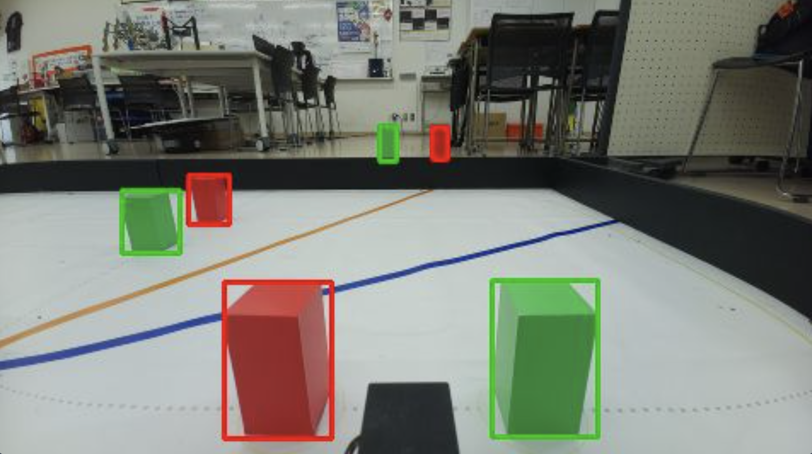
  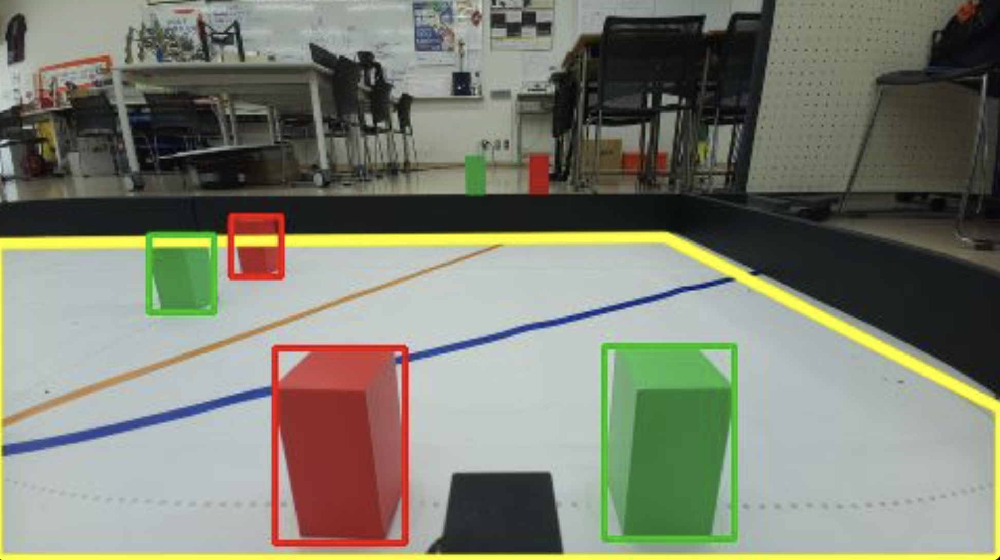

In addition, the camera recognizes a blue line to count the number of laps.

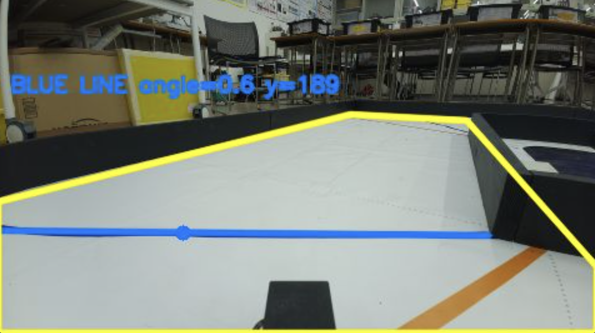

## Chassis

Most of the robot’s mechanical components, excluding electronic parts, were designed by our team and manufactured using **3D printers**. This allowed us to create custom parts that would have been difficult or impossible to produce using commercially available components, enabling a structure optimized specifically for our robot.

We selected **ABS** as the printing material. At the beginning of development, we used PLA and PETG because they were easier to print, but we decided to switch to ABS due to durability concerns(Aug. 2026).

We use a **Bambu Lab X2D** for manufacturing. At the beginning of development, all parts were produced using a **Bambu Lab A1**. However, the A1 could not print ABS, so we introduced the X2D to enable ABS printing(Jul. 2026). In addition, the **Bambu Lab X2D** improved printing speed and quality.

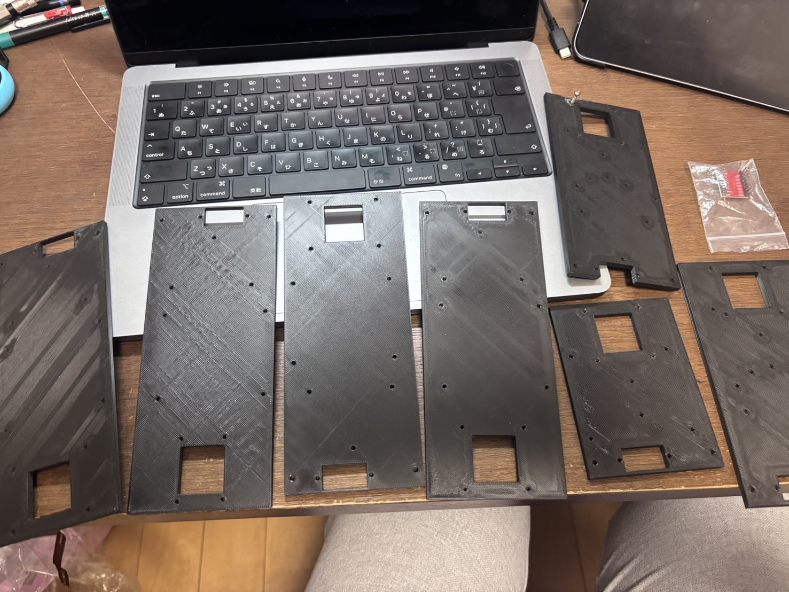
This is the PETG chassis from an early version of our robot. All parts have been fine-tuned.

## Steering Mechanism

Initially, our robot used a conventional steering mechanism. However, it could not achieve sufficient turning performance when negotiating sharp corners.

To improve cornering performance, we adopted an **Ackermann steering mechanism** for the front wheels.(Jun. 2026) This allows each front wheel to follow the appropriate turning radius while sharing the same turning center, reducing tire slip and enabling smoother cornering.

In addition, we selected **high-torque drive motors**, providing sufficient driving force even under heavy loads and ensuring stable vehicle movement.

A **differential gear** is also installed on the rear axle.(Jun. 2026) During cornering, it absorbs the rotational speed difference between the left and right wheels, reducing mechanical stress on the tires and enabling smoother turns.

## Electrical System

To prevent voltage drops and electrical noise generated by the drive motors from affecting the control system, our robot uses **separate power supplies for the drive system and the control system.**

The drive motors are powered by a battery pack consisting of **three 18650 lithium-ion batteries connected in series**. Since the fully charged battery voltage is approximately **12 V**, the motors are powered directly without additional voltage conversion.

When the voltage drops below 11 V, the robot’s movement becomes weaker. Therefore, we installed a voltmeter module on the robot to monitor the voltage(Sep. 2026).

In addition, to allow the robot to stop immediately in dangerous situations (for example, when it starts malfunctioning), we added an emergency stop button to the motor power circuit so that the robot can be stopped physically(Sep. 2026).

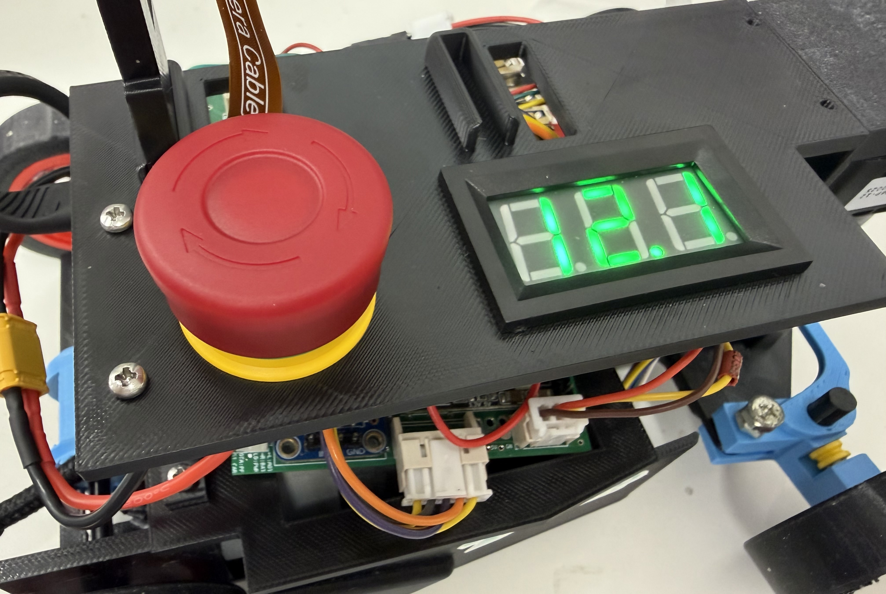

The steering servo is powered through a **buck converter (DC-DC converter)**, which steps the voltage down to **5 V** and provides a stable power supply.

The Raspberry Pi is powered by a **5,000 mAh USB Power Delivery (PD) power bank**. Separating the motor and control power supplies reduces malfunctions caused by voltage fluctuations and electrical noise, significantly improving the overall stability of the robot.

To simplify wiring as additional functions were added, we also designed and manufactured a **custom Raspberry Pi HAT board**(Jun. 2026). This board organizes the wiring, simplifies assembly and maintenance, and improves the overall maintainability of the robot.

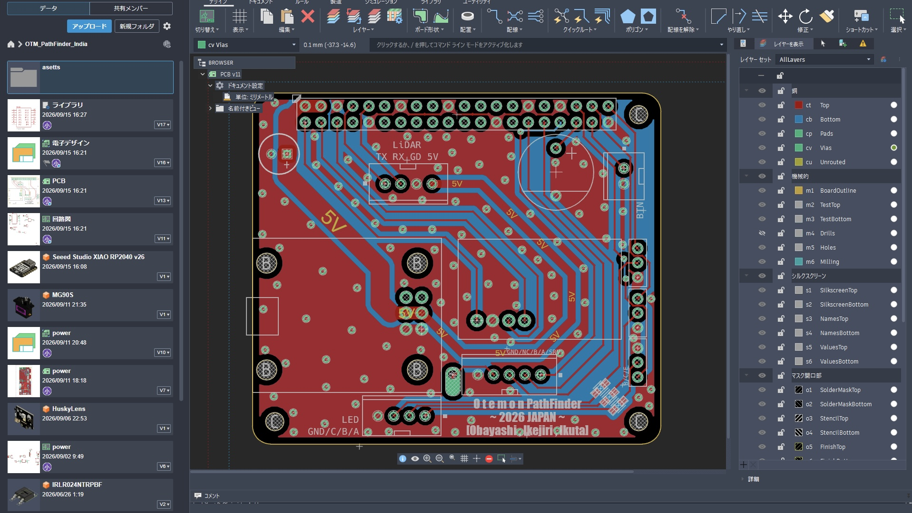

### Overall Wiring

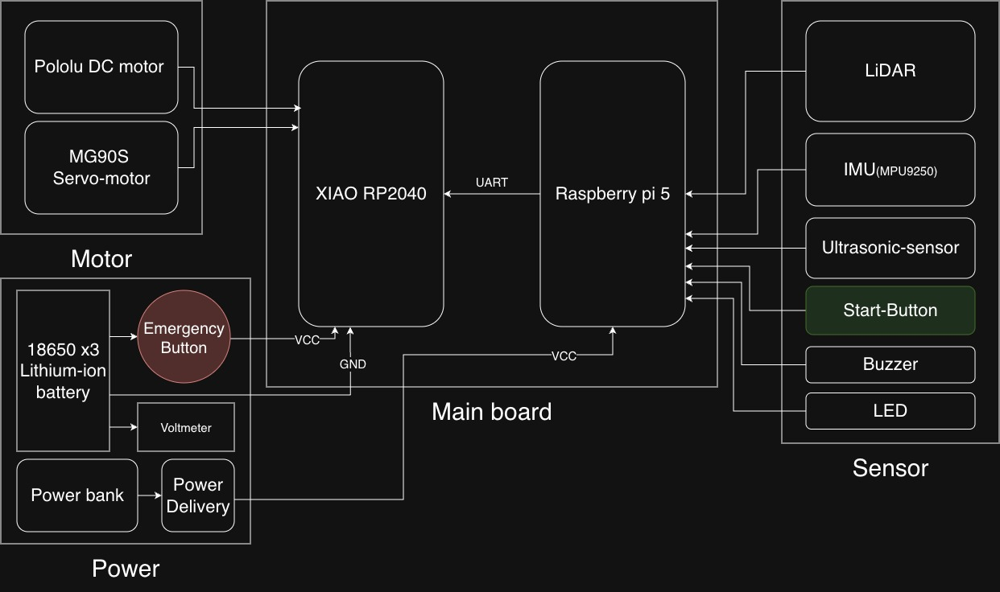

# Software

## Open Challenge

In the **Open Challenge**, the robot navigates primarily using **LiDAR**. As described earlier, we selected LiDAR because it provides distance information from almost the entire surrounding area, allowing the robot to perceive its environment with high accuracy.

During operation, the robot continuously measures the distances to the front wall and both side walls using the LiDAR. The distances to the side walls are used as the input for a **PID controller**, enabling the robot to maintain a stable position near the center of the course. In addition, at the start the robot detects the left and right walls using LiDAR, and leveraging the characteristic that the field’s inner wall is shorter than the outer wall, it decides which wall to follow based on wall length.

Just before a corner, when the distance to the front wall falls below a predefined threshold, the robot determines that it has reached the corner. It then measures the angle of the front wall with LiDAR and determines (with a gyroscope) the angle that becomes parallel to the front wall while performing the turn. This feedback-based control allows the robot to achieve stable and accurate cornering.

## Obstacle Challenge

In the **Obstacle Challenge**, the robot uses a **Raspberry Pi Camera** to detect obstacles and control its movement accordingly.

The obstacle-avoidance loop begins by checking whether an object is detected by the camera. If no object is detected, the robot repeatedly runs `find_obj` until an object is found. `find_obj` basically steers in the same direction as the lap direction while moving forward until an object is detected. However, if a wall is detected using the line at the bottom of the camera image, it interrupts this behavior and steers away from the wall until the wall is no longer detected.

Once an object is detected, the robot starts `avoid_obj` to avoid the closest object. The closest object is defined as the one appearing lowest in the image.

In `avoid_obj`, the robot avoids **red** objects by going to the right and **green** objects by going to the left. If the object being avoided disappears from the camera image and no other objects are detected, the robot returns to `find_obj`. If other objects are still detected, the robot continues `avoid_obj`, and the next closest object becomes the new target without leaving the function.

For example, if the object is green, the robot draws a line from the bottom-right corner of the image to the center of the green object, and uses PD control on the steering so that the angle inside that line matches a preset value. During `avoid_obj`, another line is drawn from the bottom-right corner to a point slightly left of the object’s left edge (object width × 3 px). This line corresponds to the path of the robot’s right edge while avoiding the object. If this line overlaps with a wall, the robot would collide with the wall if it continued, so it temporarily stops the avoidance PID control and steers left until the wall no longer overlaps with the wall-detection line. (For red objects, the left/right behavior is reversed.)

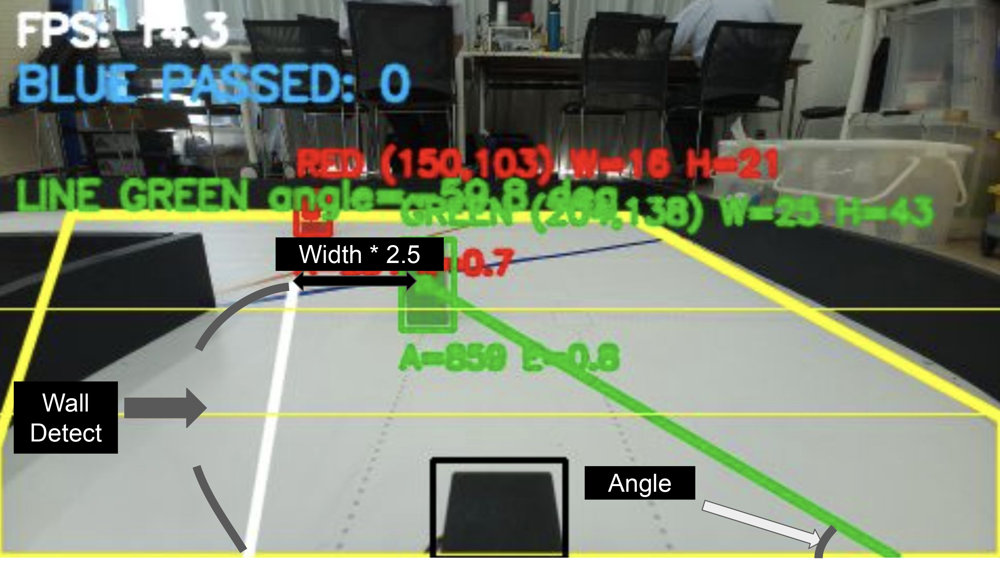
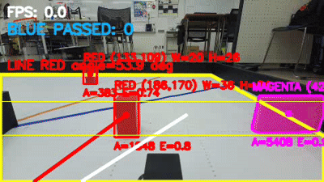

Lap counting is done by counting how many times the blue line is detected. When the blue line transitions from detected to not detected, the lap count is incremented by 1. For a few seconds after detecting the blue line, detections are ignored to prevent false double-counting when the same line briefly disappears and reappears in the camera view.

Since our robot is relatively large, it often hits the wall when starting and when parking. As a result, the start succeeded only 7 out of 10 times and parking succeeded only 4 out of 10 times, which corresponds to success rates of 70% and 40%, respectively. Considering that the scores are 7 points for starting and 15 points for parking, we concluded that it is not worth attempting them at these success rates, and we decided to give up on starting and parking.

### Flowchart

  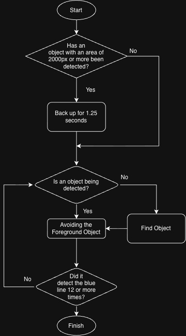

